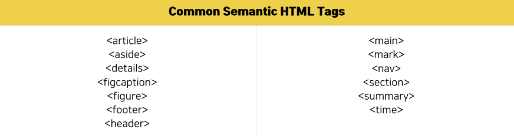

# Frontend 기술스택

먼저 프론트 엔드의 기술 스택에 대해 설명드리기 전에 다 알고 계시겠지만 기술 스택에 대해서 간단히 설명 드리도록 하겠습니다.

## 기술스택이란?

**기술 스택(tech stack)** 은 **특정 프로젝트나 애플리케이션 개발에 사용되는 기술의 모음**입니다. 여기에는 프로그래밍 언어, 프레임워크, 데이터베이스 시스템, 서버 인프라, 개발 도구 등 다양한 요소가 포함됩니다.

## 시맨틱 태그

**시맨틱 태그**에 대해서 간단히 설명드리도록 하겠습니다.

### **시맨틱 태그**는 콘텐츠의 형식 뿐만 아니라 콘텐츠의 의미와 구조를 설명합니다. 시맨틱 태그를 사용하면 접근성과, SEO, 가독성 측면에서 다양한 이점을 얻을 수 있습니다.

이제부터 시맨틱 태그가 무엇이고 시맨틱 태그 요소의 종류, 이점에 대해서 발표를 시작하도록 하겠습니다.

## 시맨틱(Semantic)이란?

우선 시맨틱(Semantic)이라는 단어는 무엇을 의미하는지 알아보도록 하겠습니다.

### **시맨틱(Semantic)** 단어 자체에는 **‘의미의, 의미론적인’** 이라는 뜻이 담겨있습니다.

이로써 **시맨틱 태그**는 태그 내용에 의미를 부여하는 태그라고 할 수 있습니다.

### 즉, 시맨틱 태그는 웹 페이지에 보이는 것 이상의 정보를 제공합니다.

그럼 이제부터 **시맨틱 태그(Semantic Tag)** 에 대해서 설명 드리도록 하겠습니다.

## 시맨틱 태그 (Semantic Tag)란?

### **시맨틱 태그 (Semantic Tag)** 는 HTML5에서 문서의 구조와 의미를 명확히 하기 위해 도입된 태그이고 포함된 콘텐츠의 특정 의미를 정의하고 목적을 갖는 태그입니다.

기존 HTML `<div>` 태그의 기능과 마찬가지로 block element이면서 사이트의 구조(레이아웃)를 설계하기 위해 존재합니다.

시맨틱 태그의 요소로는 `<header>`, `<nav>`, `<article>`, `<section>`, `<footer>`, `<main>` 등이 존재합니다. 이러한 시맨틱 태그 요소는 콘텐츠를 논리적 섹션으로 구성하고 각 부분의 역할과 기능을 전달하는 데 도움이 됩니다.

다시 말해, 시맨틱 태그는 HTML의 구조를 설계하는데 있어 **태그에 의미를 부여함으로써 웹사이트의 구조를 파악하기 쉽도록 도와주기 위해** 만들어진 것 입니다.

## 시맨틱 태그 요소의 종류



대표적으로 다음과 같은 태그가 있습니다.

- `<main>`: 메인 내용을 담는 태그로, 웹사이트의 텍스트 본문이나 콘텐츠를 나타냅니다. `<main>` 태그는 문서에서 유일해야 하고, `<article>, <aside>`, `<footer>`, `<header>`, `<nav>` 등 모든 페이지의 태그 앞에 옵니다 .

- `<nav>`: 웹사이트의 메뉴, 탭, 탐색경로 등 탐색 링크가 포함된 페이지 부분을 정의합니다. 웹 페이지의 메뉴를 일컫는 말인 ‘navigation menu’에서 따왔습니다.

`<header>`, `<footer>`, `<section>`, `<nav>`, `<article>`과 같은 요소들은 HTML5에서 기존의 `<div>`보다 더 많은 기능을 수행합니다. 이러한 주요 요소는 매크로 구조의 시맨틱 HTML로 작용하여 일반적인 HTML 태그들을 적절한 순서와 위치로 유지하는 데 도움을 줍니다.

## 시맨틱 태그의 이점

시맨틱 태그를 사용함에 따라 오는 이점에는 크게 세 가지가 존재합니다. 이 세 가지는 모두 인터넷 전반에 걸쳐 웹사이트의 일관성을 향상시키는 것과 관련이 있습니다.

```
1. 접근성 향상
2. SEO (검진엔진최적화) 향상
3. 가독성 향상
```

## 시맨틱 태그의 문제점

하지만 이러한 시맨틱 태그에도 문제점이 있을 수 있습니다.

- **개발자의 오남용**: 시맨틱 태그를 올바르게 사용하지 않으면 오히려 문서의 구조를 더 혼란스럽게 만들 수 있습니다. 예를 들어, 단순히 CSS 스타일링을 위해 시맨틱 태그를 사용하는 경우, 태그의 의미와 목적이 왜곡될 수 있습니다. 이는 접근성 도구나 검색 엔진이 페이지를 잘못 해석하는 결과를 초래할 수 있습니다.

- **레이아웃과 스타일 제어의 복잡성**: 시맨틱 태그는 본래 의미 전달을 위한 것이므로, 레이아웃과 스타일링은 주로 CSS에서 처리됩니다. 하지만 때때로 시맨틱 태그와 CSS의 조합이 예상치 못한 결과를 초래할 수 있으며, 이를 해결하는 데 추가적인 노력이 필요할 수 있습니다.

- **일관성 부족**: 시맨틱 태그는 웹 개발자들이 자주 사용하는 템플릿이나 프레임워크에 따라 서로 다르게 적용될 수 있습니다. 이런 일관성 부족은 협업 시 코드 유지보수에 어려움을 초래할 수 있습니다. 또한, 팀 내에서 시맨틱 태그 사용에 대한 명확한 규칙이 없다면, 각 개발자가 각기 다른 방식으로 태그를 사용할 수 있습니다.

이러한 문제점들은 시맨틱 태그의 이점에도 불구하고, 실제 개발에서 발생할 수 있는 이슈들입니다. 그러나 올바른 사용과 이해를 통해 대부분의 문제는 해결하거나 최소화할 수 있습니다.

## 마무리

지금까지 시맨틱 태그에 대해서 설명드렸는데요,

위에서 설명드렸던 것과 같이
**시맨틱 태그(Semantic Tag)** 는 웹페이지의 접근성을 향상 시켜주고, 검색엔진에 더 친화적으로 만들어주기도 합니다.

또한 콘텐츠의 명확하고 일관된 흐름과 구조를 만들어 웹페이지의 가독성까지 향상되게 합니다.
